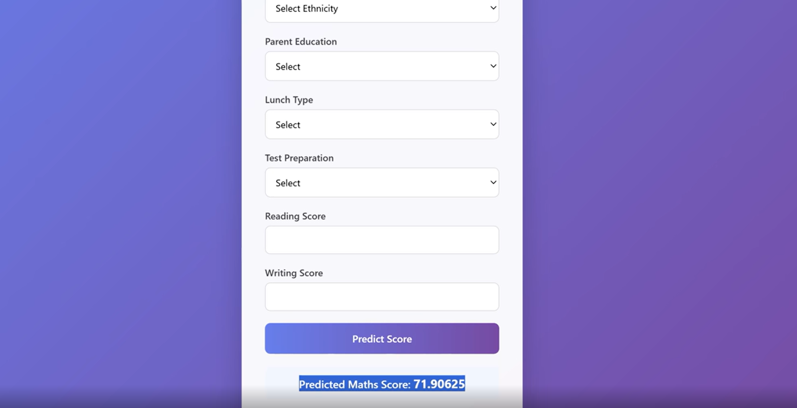
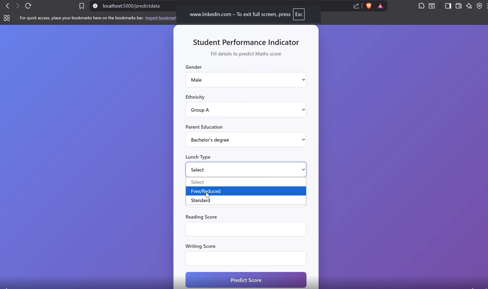

# 🎓 Student Performance Prediction System

## End-to-End Machine Learning Project with Flask

[](https://www.python.org/)
[](https://flask.palletsprojects.com/)
[](https://scikit-learn.org/)
[](https://pandas.pydata.org/)
[](https://www.docker.com/)

A complete Machine Learning application that predicts a student's
**Mathematics Score** using academic, demographic, and social factors.

This project goes beyond model training by implementing a structured ML
workflow:

**Data Ingestion → Data Validation → Data Transformation → Model
Training → Model Evaluation → Flask Prediction App**

------------------------------------------------------------------------

## 🚀 Live Demo

🔗 **Live View** `https://www.linkedin.com/posts/rohitkumar2428_student-performance-prediction-system-activity-7449660238988853248-Vz1d?utm_source=share&utm_medium=member_desktop&rcm=ACoAAFySLZUBdGjRuzt_vW2Y9QUYRGnm_FYxyq8`

📦 **GitHub Repository:**  
<https://github.com/rohit-thecoder/Student---Performance---System>

------------------------------------------------------------------------

## 📌 About the Project

The **Student Performance Prediction System** takes student information
as input and predicts the expected Mathematics Score using a trained
Machine Learning model.

The project follows a modular architecture where data processing, model
training, logging, exception handling, and prediction are separated into
different components.

### What the application does

1.  Collects student information through a web form.
2.  Processes categorical and numerical features.
3.  Applies the saved preprocessing pipeline.
4.  Loads the trained Machine Learning model.
5.  Generates the predicted Mathematics Score.
6.  Displays the result through a Flask web interface.

------------------------------------------------------------------------

## ✨ Features

- 🎯 Mathematics Score prediction
- 🧠 Machine Learning based prediction
- 📊 Numerical and categorical feature processing
- 🔄 End-to-end ML pipeline
- 🧪 Reproducible train-test split
- 💾 Saved model and preprocessing artifacts
- 🌐 Flask web application
- 🎨 User-friendly HTML interface
- 📝 Centralized logging
- ⚠️ Custom exception handling
- 🐳 Docker support
- 📁 Modular project structure

------------------------------------------------------------------------

## 📊 Dataset

The project uses a student performance dataset containing academic,
demographic, and social information.

### Input Features

| Feature                     | Description                     | Type        |
|-----------------------------|---------------------------------|-------------|
| Gender                      | Student's gender                | Categorical |
| Race/Ethnicity              | Student's ethnicity group       | Categorical |
| Parental Level of Education | Parent/guardian education level | Categorical |
| Lunch                       | Type of lunch received          | Categorical |
| Test Preparation Course     | Test preparation status         | Categorical |
| Reading Score               | Student's reading score         | Numerical   |
| Writing Score               | Student's writing score         | Numerical   |

### 🎯 Target Variable

**Math Score**

The trained model uses the input features above to estimate the
student's Mathematics Score.

------------------------------------------------------------------------

## 🧠 Machine Learning Pipeline

``` text
┌─────────────────┐
│   Raw Dataset   │
└────────┬────────┘
         ↓
┌─────────────────┐
│ Data Ingestion  │
└────────┬────────┘
         ↓
┌─────────────────┐
│ Data Validation │
└────────┬────────┘
         ↓
┌──────────────────┐
│ Data Transformation│
└────────┬─────────┘
         ↓
┌─────────────────┐
│ Model Training  │
└────────┬────────┘
         ↓
┌─────────────────┐
│ Model Evaluation│
└────────┬────────┘
         ↓
┌─────────────────┐
│   model.pkl     │
└────────┬────────┘
         ↓
┌─────────────────┐
│ Flask Web App   │
└────────┬────────┘
         ↓
┌─────────────────┐
│    Prediction   │
└─────────────────┘
```

------------------------------------------------------------------------

## 🔍 Workflow

### 1. Data Ingestion

The dataset is loaded and divided into training and testing datasets.

Generated files:

``` text
artifacts/
├── train.csv
└── test.csv
```

### 2. Data Validation

The validation stage checks whether the dataset follows the expected
structure and schema before further processing.

### 3. Data Transformation

The transformation stage prepares the data for Machine Learning.

It handles:

- Categorical features
- Numerical features
- Feature preprocessing
- Transformation required by the ML models

The fitted preprocessing pipeline is saved as:

``` text
preprocessor.pkl
```

### 4. Model Training

The transformed training data is passed to the model training stage.

The trained model is saved as:

``` text
model.pkl
```

### 5. Prediction

When a user submits the form:

``` text
User Input
    ↓
Flask Application
    ↓
Saved Preprocessor
    ↓
Trained ML Model
    ↓
Predicted Math Score
```

------------------------------------------------------------------------

## 🏗️ Project Structure

``` text
MLPROJECT/
│
├── artifacts/
│   ├── model.pkl
│   ├── preprocessor.pkl
│   ├── train.csv
│   └── test.csv
│
├── catboost_info/
│
├── logs/
│
├── notebook/
│
├── src/
│   ├── components/
│   │   ├── artifacts/
│   │   ├── logs/
│   │   ├── __init__.py
│   │   ├── data_ingestion.py
│   │   ├── data_transformation.py
│   │   └── model_trainer.py
│   │
│   ├── pipeline/
│   │   ├── __init__.py
│   │   ├── exception.py
│   │   ├── logger.py
│   │   └── utils.py
│   │
│   └── __init__.py
│
├── templates/
│   ├── home.html
│   └── index.html
│
├── .dockerignore
├── .gitignore
├── application.py
├── Dockerfile
├── README.md
├── requirements.txt
└── setup.py
```

------------------------------------------------------------------------

## 🧩 Important Files

| File                     | Responsibility                                  |
|--------------------------|-------------------------------------------------|
| `application.py`         | Flask application, routes, and prediction logic |
| `data_ingestion.py`      | Loads dataset and creates train/test data       |
| `data_transformation.py` | Data preprocessing and transformation           |
| `model_trainer.py`       | Model training and evaluation                   |
| `exception.py`           | Custom exception handling                       |
| `logger.py`              | Centralized logging                             |
| `utils.py`               | Reusable utility functions                      |
| `model.pkl`              | Serialized trained ML model                     |
| `preprocessor.pkl`       | Serialized preprocessing pipeline               |
| `home.html`              | Main frontend page                              |
| `index.html`             | Prediction interface                            |

------------------------------------------------------------------------

## 🛠️ Tech Stack

### Programming Language

- Python

### Data Science & Machine Learning

- NumPy
- Pandas
- Scikit-learn
- CatBoost

### Web Development

- Flask
- HTML
- CSS

### Tools & Deployment

- Git
- GitHub
- Docker
- Python Virtual Environment

------------------------------------------------------------------------

## ⚙️ Installation & Setup

### 1. Clone the Repository

``` bash
git clone https://github.com/rohit-thecoder/Student---Performance---System.git
cd Student---Performance---System
```

### 2. Create a Virtual Environment

#### Windows

``` bash
python -m venv venv
venv\Scripts\activate
```

#### macOS / Linux

``` bash
python3 -m venv venv
source venv/bin/activate
```

### 3. Install Dependencies

``` bash
pip install -r requirements.txt
```

### 4. Run the Application

``` bash
python application.py
```

Open the application in your browser:

``` text
http://127.0.0.1:5000/
```

------------------------------------------------------------------------

## 🐳 Docker Deployment

Build the Docker image:

``` bash
docker build -t student-performance-prediction .
```

Run the container:

``` bash
docker run -p 5000:5000 student-performance-prediction
```

Then open:

``` text
http://localhost:5000/
```

------------------------------------------------------------------------

## 📦 Model Artifacts

The training pipeline generates reusable artifacts.

| Artifact           | Purpose                                   |
|--------------------|-------------------------------------------|
| `model.pkl`        | Stores the trained Machine Learning model |
| `preprocessor.pkl` | Stores the fitted preprocessing pipeline  |
| `train.csv`        | Training dataset                          |
| `test.csv`         | Testing dataset                           |

The saved artifacts allow the Flask application to make predictions
without retraining the model for every request.

------------------------------------------------------------------------

## 🧪 Example Input

``` text
Gender: Female
Race/Ethnicity: Group B
Parental Education: Bachelor's Degree
Lunch: Standard
Test Preparation: Completed
Reading Score: 72
Writing Score: 74
```

### Example Output

``` text
Predicted Mathematics Score: XX.XX
```

The exact prediction depends on the trained model.

> This prediction is a Machine Learning estimate and should not be
> treated as an official academic assessment.

------------------------------------------------------------------------

## 🖼️ Screenshots

Create a `screenshots` folder in the repository:

``` text
screenshots/
├── home.png
├── prediction.png
└── result.png
```

Then add your images like this:

``` markdown



```

------------------------------------------------------------------------

## 📈 Why This Project?

The goal of this project was not just to train a Machine Learning model.

It was to understand how a real ML application can be structured from
**raw data to deployment**.

``` text
Machine Learning
       +
Software Engineering
       +
Web Development
       +
Docker
       ↓
Complete ML Application
```

------------------------------------------------------------------------

## 📚 What I Learned

This project helped me gain practical experience with:

- End-to-end Machine Learning workflows
- Data ingestion and validation
- Data preprocessing
- Model training and evaluation
- Model serialization
- Modular Python architecture
- Flask application development
- Frontend-backend integration
- Logging
- Custom exception handling
- Docker
- Git and GitHub
- Deployable Machine Learning applications

------------------------------------------------------------------------

## 🔮 Future Improvements

- [ ] Add model performance metrics to the UI
- [ ] Add data visualizations
- [ ] Add prediction history
- [ ] Add REST API endpoints
- [ ] Improve responsive UI
- [ ] Add automated testing
- [ ] Add CI/CD pipeline
- [ ] Add model monitoring
- [ ] Add cloud deployment

------------------------------------------------------------------------

## 👨‍💻 Author

### Rohit Kumar

**B.Tech CSE \| Machine Learning & AI Enthusiast**

- GitHub: <https://github.com/rohit-thecoder>
- LinkedIn: `https://www.linkedin.com/in/rohitkumar2428`


------------------------------------------------------------------------

## ⭐ Support

If you found this project useful, consider giving the repository a ⭐ on
GitHub.

------------------------------------------------------------------------

### Built with Python, Machine Learning & Flask ❤️
